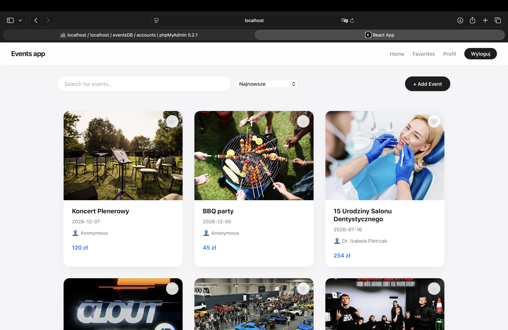
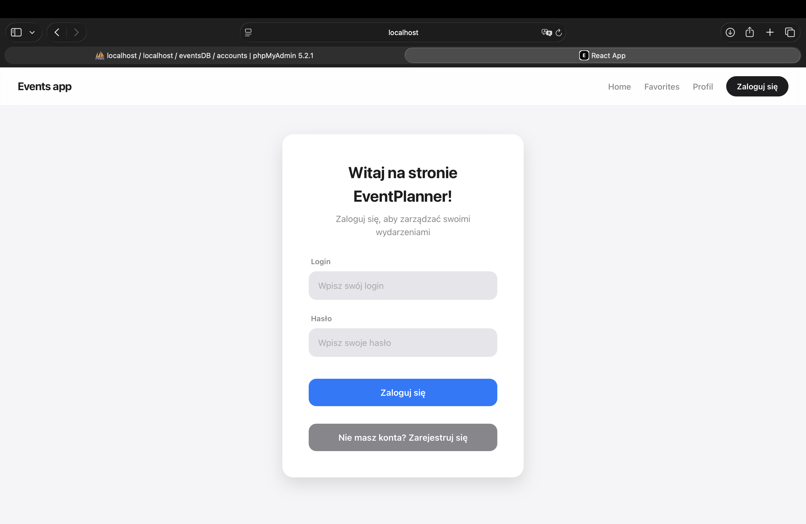
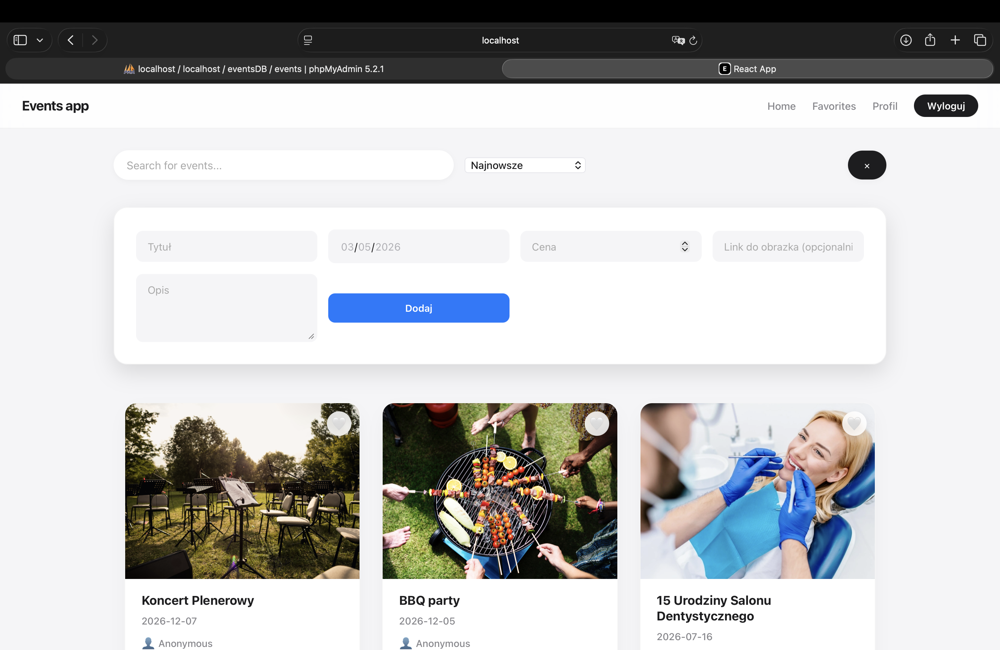
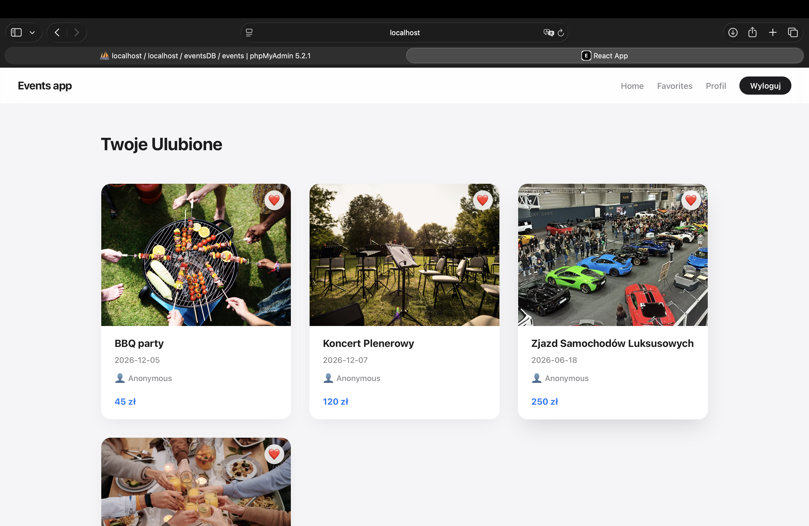
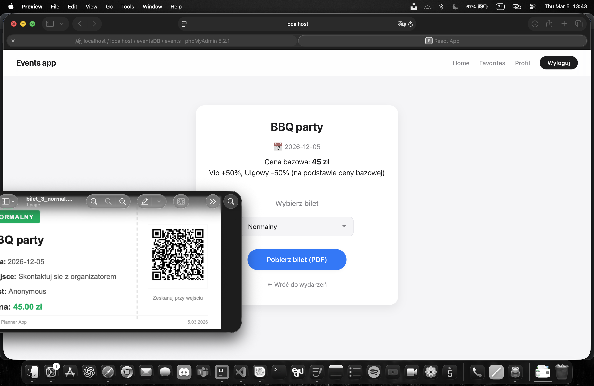
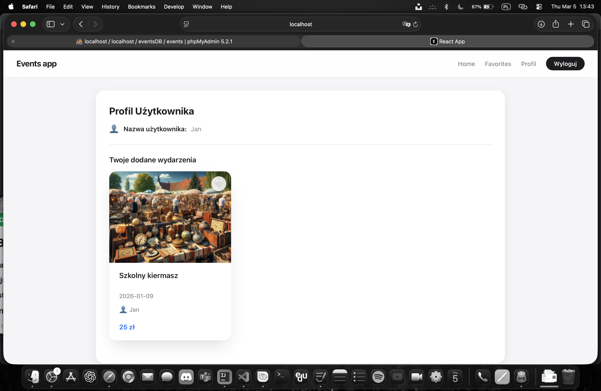

# Event Planner

[](https://opensource.org/licenses/MIT)

Aplikacja do odkrywania, planowania i zarządzania eventami. Aplikacja webowa z systemem autentykacji, ulubionymi, biletami i profilem użytkownika.

## Screenshots








---

## Spis Treści

- [Funkcjonalności](#funkcjonalności)
- [Tech Stack](#tech-stack)
- [Instalacja](#instalacja)
- [Uruchomienie](#uruchomienie)
- [Struktura Projektów](#struktura-projektów)
- [API Endpoints](#api-endpoints)
- [Jak Używać](#jak-używać)

---

## Funkcjonalności

### Autentykacja

- Rejestracja nowych użytkowników
- Logowanie z JWT
- Ochrona tras (Protected Routes)
- Profil użytkownika

### Zarządzanie Eventami

- Przeglądanie listy dostępnych eventów
- Dodawanie nowych eventów
- Filtrowanie i wyszukiwanie
- Zapisywanie do ulubionych
- Zarządzanie ulubionymi eventami

### Bilety

- Wyświetlanie Twoich rezerwacji
- Generowanie biletów w formacie PDF
- Kody QR na biletach
- Pobieranie biletów

### Profil

- Wyświetlanie danych użytkownika
- Historia rezerwacji
- Ustawienia profilu

---

## Tech Stack

### Frontend

- **React** (v19.2.3) - Biblioteka UI
- **React Router** (v7.13.0) - Routing i nawigacja
- **CSS** - Styl
- **html2canvas** - Konwersja HTML na obrazy
- **jspdf** - Generowanie PDF
- **qrcode.react** - Generowanie kodów QR

### Backend

- **Node.js + Express** (v5.2.1) - Serwer HTTP
- **MySQL** - Baza danych
- **JWT** (jsonwebtoken) - Autentykacja
- **bcrypt** - Hashowanie haseł
- **CORS** - Bezpieczeństwo

---

## Instalacja

### Wymagania

- **Node.js** (v16+)
- **npm**
- **MySQL** (uruchomiony serwer)

### Kroki Instalacji

#### 1. Sklonuj repozytorium

```bash
git clone https://github.com/janskwarek/EventPlanner-React-Node.js.git
cd EventPlanner-React-Node.js/eventplannernowy
```

#### 2. Instalacja Frontend

```bash
npm install
```

#### 3. Instalacja Backend

```bash
cd backend
npm install
```

#### 4. Konfiguracja Bazy Danych

Edytuj plik `backend/db.js` i dodaj swoje dane MySQL:

```javascript
const connection = mysql.createConnection({
  host: "localhost",
  user: "root",
  password: "",
  database: "eventplanner",
});
```

---

## Uruchomienie

### Opcja 1: Uruchomienie osobnych terminalów (zalecane)

**Terminal 1 - Backend:**

```bash
cd backend
npm run dev
# Lub: npm start
```

Backend będzie dostępny na: **http://localhost:5001**

**Terminal 2 - Frontend:**

```bash
npm start
```

Frontend będzie dostępny na: **http://localhost:3000**

## Struktura Projektów

### Frontend (`/eventplannernowy`)

```
src/
├── pages/              # Strony aplikacji
│   ├── Home.jsx       # Główna strona z eventami
│   ├── Favorites.jsx  # Ulubione eventy
│   ├── Tickets.jsx    # Moje rezerwacje/bilety
│   ├── ProfilePage.jsx # Mój profil
│   ├── Login.jsx      # Strona logowania
│   └── Register.jsx   # Strona rejestracji
├── components/         # Komponenty React
│   ├── NavBar.jsx     # Pasek nawigacji
│   ├── EventCard.jsx  # Karta eventu
│   ├── AddEventForm.jsx # Formularz dodawania
│   ├── ProfileDetails.jsx # Pokazanie danych profilu
│   ├── TicketPDF.jsx  # Generowanie PDF biletu
│   └── ProtectedRoute.jsx # Ochrona tras (wymaga logowania)
├── css/               # Stylowanie
│   ├── App.css
│   ├── Home.css
│   ├── Login.css
│   ├── Favorites.css
│   └── ...
├── assets/            # Obrazy, ikony, media
├── App.jsx            # Główny komponent
└── index.jsx          # Punkt wejścia

public/               # Pliki statyczne
├── index.html
├── manifest.json
└── robots.txt
```

### Backend (`/backend`)

```
backend/
├── server.js          # Główny plik serwera (PORT 5001)
├── db.js              # Konfiguracja bazy danych MySQL
├── loginRoute.js      # Endpointy logowania
├── loginController.js # Logika logowania
├── registerRoute.js   # Endpointy rejestracji
├── registerController.js # Logika rejestracji
├── eventsRoute.js     # Endpointy eventów
├── favoritesRoute.js  # Endpointy ulubionych
├── userEventsRoute.js # Endpointy eventów użytkownika
└── package.json       # Zależności
```

---

## API Endpoints

### Autentykacja

| Metoda | Endpoint        | Opis                           |
| ------ | --------------- | ------------------------------ |
| POST   | `/api/login`    | Logowanie użytkownika          |
| POST   | `/api/register` | Rejestracja nowego użytkownika |

### Eventy

| Metoda | Endpoint          | Opis                        |
| ------ | ----------------- | --------------------------- |
| GET    | `/api/events`     | Pobranie wszystkich eventów |
| POST   | `/api/events`     | Dodanie nowego eventu       |
| GET    | `/api/events/:id` | Pobranie szczegółów eventu  |
| DELETE | `/api/events/:id` | Usunięcie eventu            |

### Ulubione

| Metoda | Endpoint                  | Opis                 |
| ------ | ------------------------- | -------------------- |
| GET    | `/api/favorites`          | Moje ulubione eventy |
| POST   | `/api/favorites/:eventId` | Dodaj do ulubionych  |
| DELETE | `/api/favorites/:eventId` | Usuń z ulubionych    |

### Bilety/Rezerwacje

| Metoda | Endpoint           | Opis              |
| ------ | ------------------ | ----------------- |
| GET    | `/api/user/events` | Moje rezerwacje   |
| GET    | `/api/tickets`     | Moje bilety       |
| POST   | `/api/tickets`     | Rezerwacja biletu |

---

## Jak Używać aplikacji

### 1. Rejestracja

- Kliknij **"Register"** na pasku nawigacji
- Wypełnij formularz (email, hasło, itp.)
- Kliknij "Sign Up"
- Jesteś zalogowany! ✅

### 2. Przeglądanie Eventów

- Na stronie **Home** zobaczysz listę dostępnych eventów
- Każdy event ma kartę z podstawowymi informacjami
- Możesz filtrować wg kategorii/daty (jeśli zaimplementowane)

### 3. Ulubione

- Kliknij serce na karcie eventu
- Event pojawi się w sekcji **Favorites**
- Możesz je usunąć po kliknięciu ponownie

### 4. Rezerwacja i Bilет

- Kliknij kup na evencie
- Bilет zostanie dodany do **Tickets**
- Pobierz PDF z kodem QR

### 5. Profil

- Wyświetl swoje dane i historię dodawania wydazen

### 6. Wylogowanie

- Kliknij w pasku nawigacji "Wyloguj"

---

## Bezpieczeństwo

- **JWT** - Tokeny do autentykacji
- **Bcrypt** - Hasła hashowane (nie przechowywane w czyszczeniu)
- **Protected Routes** - Strony chronione wymagają logowania
- **CORS** - Bezpieczeństwo cross-origin
- **HttpOnly Cookies** - Opcjonalne dla tokenów

---

## Rozwiązywanie Problemów

### Backend nie uruchamia się

```bash
# Sprawdź czy port 5001 nie jest zajety
lsof -i :5001

# Sprawdź połączenie z MySQL
# Edytuj backend/db.js i weryfikuj dane
```

### Frontend nie widzi backendzie

```bash
# Sprawdź czy proxy jest skonfigurowany w package.json
"proxy": "http://localhost:5001"

# Sprawdź czy backend jest uruchomiony
curl http://localhost:5001
```

### Błędy MySQL

```javascript
// Upewnij się że baza i tabele istnieją
// Edytuj backend/db.js i dodaj swoje dane
```

---

## Notatki Deweloperskie

### Fluktuacja między komponentami

- Frontend renderuje się w React (SPA - Single Page Application)
- Tokeny logowania są przechowywane w localStorage/sessionStorage
- Backend sprawdza JWT przy każdym zapytaniu

### Generowanie PDF

- Komponent `TicketPDF.jsx` używa **html2canvas** i **jspdf**
- Kod QR generowany przez **qrcode.react**

### Routing

- Protected Routes wymagają istniejącego tokena JWT
- Jeśli nie ma tokena → redirect na Login

---

## License

This project is licensed under the MIT License - see the [LICENSE](./LICENSE) file for details.

Copyright (c) 2026 Jan Skwarek
